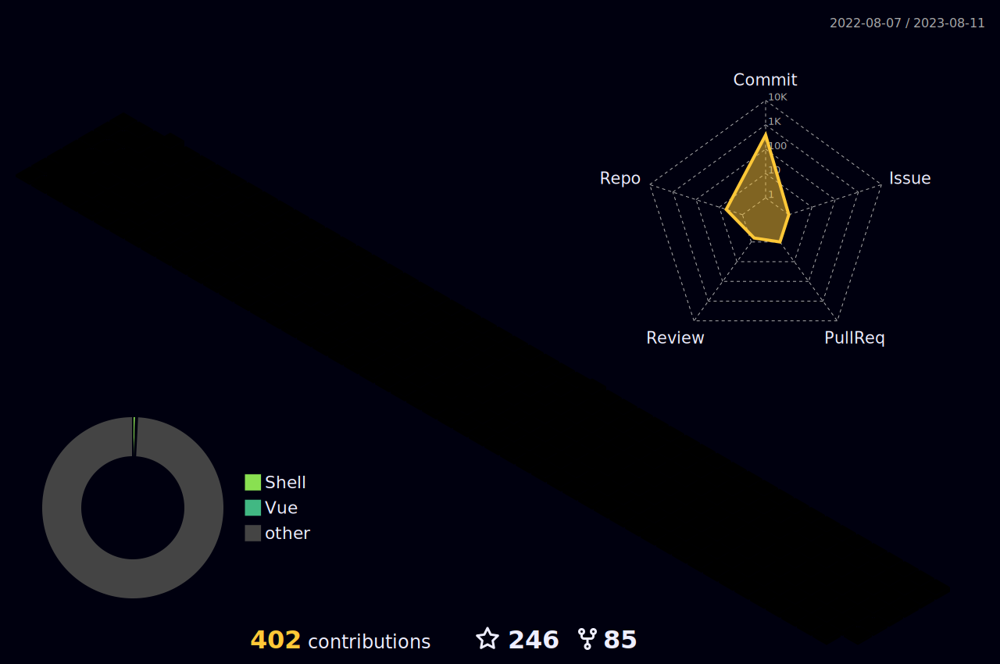

<h1 align="center">Hi 👋, I'm CRPER</h1>
<h3 align="center">A passionate frontend developer from China</h3>

  

  

- 🔭 I’m currently working on **待业中**
- 🌱 I’m currently learning **Rust,Web3**
- 👨‍💻 All of my projects are available at [https://github.com/crper](https://github.com/crper)
- 📝 I regularly write articles on [https://www.yuque.com/crper/blog](https://www.yuque.com/crper/blog)
- 💬 Ask me about **一个特立独行的俗人, 活着就不能停下思考， 尽量让生活变得充实,有趣！**
- 📫 How to reach me **crper@outlook.com**
- 📄 Know about my experiences [https://www.yuque.com/crper/blog/about_me](https://www.yuque.com/crper/blog/about_me)

Languages and Tools:

                                           

 

## [The weather of Shenzhen in the last three days](https://github.com/crper/action-wttr-fetch-city)

